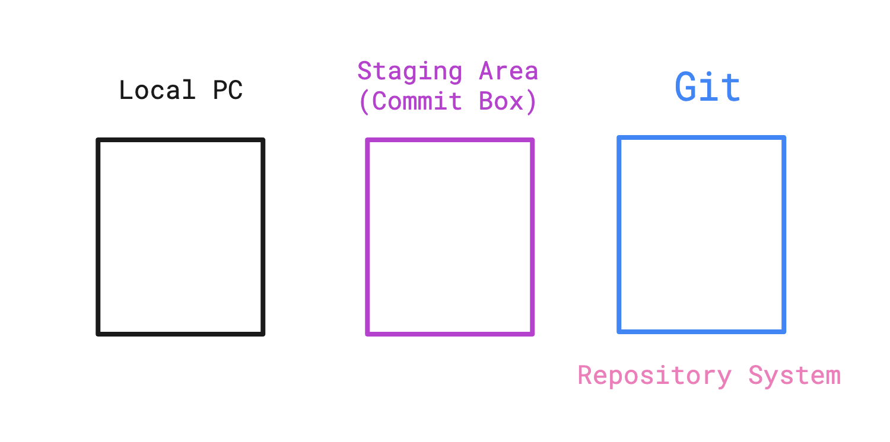

# __Git_study__ 
🍀🍀🍀🍀🍀🍀🍀🍀🍀🍀

### __Git 이란?__
- 버전을 편리하게 관리할 수 있도록 도와주는 도구
- 작업하고 있는 파일들을 원하는 순간으로 다시 돌아갈 수 있게끔 만들어주는 도구
- VCS ( Version Control System )
- Distributed Version Control : 모든 개발자들이 동일한 히스토리 정보를 가지고 있는 것 ( 분산 시스템 )
- Snapshot 형식으로 저장된다. :camera:

### __Git 의 장점__
1. most commonly used : 보편적으로 사용되고 있음
2. free : 무료
3. open source : 오픈소스
4. lightning fast : 모든 동작들이 굉장히 빠름
5. work offline : 오프라인에서도 일을 할 수 있음
6. undo mistakes : 실수를 다시 고쳐나가기가 쉬움
7. easy and fast branching/merging : 쉽고 빠른 브랜칭을 이용해서 각각의 브랜치로 효율적인 협업 가능

---
### __git config__
Git을 설치하게되면 Git에 관련된 모든 환경설정이 .gitconfig 라는 파일 안에 저장이 되는데 터미널에서 확인해 볼 수 있다.
- git config --list : 모든 설정 확인 가능
- git config --global -e : 수정하고 싶을 때
- git config --global core.editor "code --wait" : config수정을 vscode로 변경
  - vscode에서 Shell Command: Install 'code' ~ 설치해야됨.
- git config --global user.name "~~~" : 사용자 이름 설정
- git config --global user.email "~~~" : 사용자 이메일 설정
- git config user.name : 사용자 이름 출력
- git config --global core.autocrlf input/true : Mac:input, Window:true
  - 운영체제마다 에디터에서 줄바꿈을 할 때 들어가는 문자열이 달라짐. 이 부분을 맞춰주기 위해 설정해줘야 함!(carriage-return)
- git config -h : 명령어에서 쓸 수 있는 속성값들 출력

---

### __git init__
Git 을 초기화 시키는 명령어 : .git 생성 

---
### __git status__
Git 의 상태를 볼 수 있는 명령어
  - git config --global alias.st status : git status -> git st 
  - git status -h : 추가적인 속성들 확인 가능
  - default 값 : --long
  - git status -s : 간단ver

---
### __Git System 간단하게 그려봤어요__


- Staging Area 를 commit 들을 담는 Box 라고 이해했음!
- Staging Area == stage
- 부족하지만 이 구조에서 수정을 거쳐가며 공부할 예정!^^

---
### __git add__
파일을 stage에 올리는 명령어
  - modified : 수정된 파일
  - git add . : ".gitignore"파일에 있는 파일명들은 제외하고 stage에 올리는 명령어
  - git add *  : ".gitignore"파일에 있는 파일들도 stage로 올리는 명령어

---
### __git rm --cached <file이름>__
stage에 올린 파일을 다시 untracked 상태로 되돌리는 명령어
  - 즉 git 에 올리지 않고 내 local PC에만 남기겠다는 뜻

---
### __.gitigore__
echo 무시해야할파일 > .gitignore
  - "."이 앞에 붙는 파일들은 숨김파일
  - ex) log.log , \*.log , build/ , build\/*.log

---
### __git diff__
정확하게 어떤 내용이 수정되었는지 확인하기 위한 명령어
- git diff : working directory 안에 있는 변경사항만 확인가능
- git diff --staged : stage에 있는 변경사항 확인가능
- git diff --cached : --staged 랑 똑같음
- vscode 로 변경사항 확인 가능
  - git config --global -e 모드로 열어서 하단 코드 입력
    ```
    [diff]
      tool = vscode
    [difftool "vscode"]
      cmd = code --wait --diff $LOCAL $REMOTE
    ```
- git difftool (--staged) : vscode로 변경사항 확인가능

---

### __git commit__
stage에 있는 변경사항을 Git repository에 옮겨주는 역할
- git commit -m "~~~" : 커밋메시지 등록
- git commit -am "~~~" : working directory에 있는 모든 파일들을 메시지와 함께 commit

